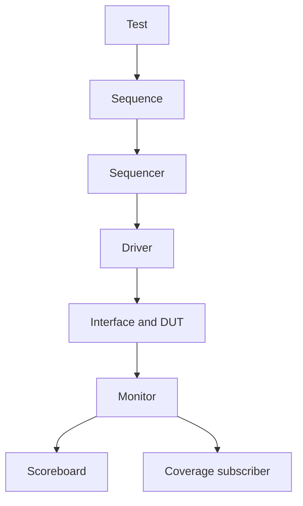

# UVM Verification Learning Series

[](https://github.com/ashishkommineni/uvm-verification-learning-series/actions/workflows/ci.yml)

This repository is a topic-by-topic UVM learning path built around one small,
complete verification environment. The notes explain how data and control move
through a testbench and why each layer exists; they do not stop at macro syntax.

Every chapter answers practical engineering questions:

1. What is this UVM construct?
2. Why is it needed?
3. How do ownership, control, and data move internally?
4. Where is it used in the executable project?
5. How can I explain it naturally in an interview?
6. What exact syntax and ordering matter?
7. Which edge cases create false passes, hangs, or races?
8. Which follow-up questions should I be ready to answer?

> Scope: this covers the UVM concepts needed to build, configure, run, debug,
> and scale an environment. It complements, rather than replaces, IEEE 1800.2.

## Learning path

| Chapter | Topic | Working reference |
|---|---|---|
| 00 | Architecture and transaction data flow | Complete mini-bus environment |
| 01 | `uvm_object` versus `uvm_component` | Item and hierarchy classes |
| 02 | Transactions, constraints, copy/compare/print | `mini_bus_item` |
| 03 | Sequences, sequencers, arbitration, responses | Directed/random sequences |
| 04 | Driver and virtual interface | Request/response pin driving |
| 05 | Monitor and analysis port | Accepted-transfer reconstruction |
| 06 | Active/passive agent | `mini_bus_agent` |
| 07 | TLM, reference model, scoreboard | In-order memory predictor |
| 08 | Phases, objections, end-of-test | Two executable tests |
| 09 | Factory and overrides | Boundary-item type override |
| 10 | `uvm_config_db` scope and precedence | Interface/count configuration |
| 11 | Virtual sequences and coordination | Focused two-sequencer example |
| 12 | Functional coverage and SVA | Subscriber and protocol properties |
| 13 | Register abstraction layer | Register/block/map/adapter example |
| 14 | Reporting, callbacks, debug, timeout | Debug playbook and callback code |
| 15 | Interview preparation | 80 practical Q&A |
| 16 | Test, environment, and typed configuration | Ownership and construction flow |
| 17 | TLM interfaces and FIFOs | Put/get/peek/transport, analysis, FIFO |
| 18 | Advanced sequences | Arbitration, lock/grab, responses, IDs |
| 19 | Advanced phasing | Runtime subphases, domains, drain, jumps |
| 20 | UVM services and object utilities | Reports, CLI, events, barriers, recording |
| 21 | Reset, negative tests, and regression closure | Recovery, reproducibility, signoff |

Use the [topic coverage matrix](docs/topic_coverage_matrix.md) to map each UVM
concept to its detailed lesson and code evidence.

## Executable project

The DUT is a one-response-later byte-addressed memory. It is intentionally
small so the verification architecture remains visible.



The monitor is the source of truth. The scoreboard predicts from operations
actually accepted and completed at the pins, never only from generator intent.

## Included engineering features

- Constrained transaction plus factory-derived boundary transaction.
- Directed and constrained-random sequences with randomization failure checks.
- Sequence-driver request handshake and deterministic completion.
- Virtual interface, active/passive agent structure, environment, and tests.
- Analysis-port fanout to scoreboard and coverage subscriber.
- Self-checking reference model with exact transaction counts.
- Concurrent assertions and assertion cover properties.
- Factory override and `config_db` examples in the executable path.
- Focused configuration, TLM, response-routing, virtual-sequence, callback,
  synchronization-service, and RAL reference code.
- Xcelium regression target and portable RTL/SVA smoke test.
- Optional full-UVM path for a recent Verilator plus Accellera UVM.
- Verification plan, expected output, simulator boundary, and result record.

## Repository map

```text
uvm-verification-learning-series/
├── lessons/                 twenty-two concept and interview guides
├── rtl/                     synthesizable mini-bus memory
├── tb/
│   ├── assertions/          protocol SVA
│   ├── interfaces/          signal and timing bundle
│   ├── pkg/                 UVM package and compile order
│   ├── smoke/               portable self-check
│   ├── top/                 DUT, config_db, and run_test()
│   └── uvm/                 item through test, one concern per file
├── examples/                focused advanced UVM references
├── docs/                    plan, results, topic index, run guides
├── scripts/                 reproducible checks
└── sim/                     deterministic file lists
```

## Run with Cadence Xcelium

Requirements: licensed Xcelium with `xrun` on `PATH`.

```sh
make uvm TEST=mini_bus_test SEED=13
make uvm TEST=mini_bus_boundary_test SEED=31
make regress
```

The Xcelium target enables code and functional coverage. See
[the Xcelium guide](docs/xcelium_guide.md).

## Run portable checks

RTL plus SVA smoke:

```sh
make check
```

Optional full UVM with a recent Verilator and Accellera UVM checkout:

```sh
export UVM_HOME=/path/to/uvm-core
make uvm-lint
make uvm-portable TEST=mini_bus_test SEED=13 JOBS=2
```

`uvm-lint` also checks the focused configuration, TLM, response, service,
callback, virtual-sequence, and RAL examples.
Covergroups are disabled on the portable path; Xcelium is the coverage/signoff
simulator. This boundary is documented rather than hidden.

## Stable pass criteria

`mini_bus_test` must report exactly 44 observed operations; the boundary test
must report 20. Both must end with zero UVM errors and fatals.

```text
UVM_INFO ... [SCOREBOARD] seen=44 ... errors=0
UVM_ERROR :    0
UVM_FATAL :    0
```

Commands and expected output are not presented as executed evidence. Current
results are recorded in [the verification report](docs/verification_report.md).

## License

MIT. See [LICENSE](LICENSE).
